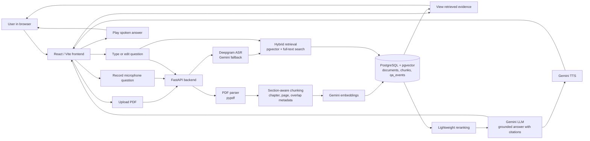

# Architecture and Acceptance Strategy

## Assignment Mapping

- Web application: Vite + React frontend with a FastAPI backend.
- PDF book upload: `/api/documents/upload` accepts PDFs and stores parsed chunks in PostgreSQL.
- At least 10 chapters: the sample PDF generator creates a 10-chapter book, and the backend surfaces a warning status if an uploaded PDF has fewer.
- ASR: `/api/ask/voice` accepts browser microphone audio and calls Deepgram Nova-3 to transcribe it. Gemini audio understanding remains as a fallback.
- RAG: PDF text is parsed into detected sections, indexed as section-aware chunks, and retrieved with hybrid search.
- TTS: generated answers are sent to Gemini text-to-speech and returned as base64 WAV audio for browser playback.

## System Architecture

High-level flow:

1. Uploaded PDFs are parsed, chunked by detected sections, embedded, and stored in PostgreSQL with `pgvector`.
2. A user question is captured through voice or text. Voice input is transcribed before retrieval.
3. The backend retrieves relevant chunks using hybrid semantic and keyword search, reranks them, and passes only the selected evidence to Gemini.
4. The generated answer, citations, and synthesized audio are returned to the frontend for review and playback.

## Retrieval Quality

Naive fixed-size chunking is avoided. The indexer uses:

- Heading detection so each chunk carries detected section/chapter metadata.
- Paragraph and sentence-aware chunking with overlap to preserve local context.
- Dense vector retrieval through pgvector HNSW.
- PostgreSQL full-text search for exact terminology, numbers, and names.
- A lightweight reranker that combines semantic score, keyword score, query-term coverage, and chapter-title relevance.

This follows the current practical pattern of retrieve, rerank, generate. Recent RAG benchmarks continue to show that hybrid retrieval plus reranking is stronger than relying on only dense search, especially for long technical documents and precise factual questions.

## AI Provider Choice

Gemini remains the reasoning and generation provider:

- `gemini-embedding-001` for retrieval embeddings.
- `gemini-3.1-flash-lite` for grounded answer generation.
- `gemini-3.1-flash-tts-preview` for browser-playable speech synthesis.

Deepgram Nova-3 is used for ASR because it is a dedicated speech-to-text model and its public pricing page lists a free $200 credit with no credit card required. The project also includes deterministic hashing embeddings and fallback text responses so tests and UI demos can run without spending credits. For quota safety, the app sends only retrieved chunks to Gemini, not the full uploaded PDF.

## Free-Tier Fit

The sample PDF creates a small set of section-aware chunks. A normal demo flow uses:

- One embedding call per stored chunk during sample PDF upload.
- 1 query embedding call per question.
- 1 answer-generation call per question with roughly six chunks of context.
- 1 short TTS call per spoken answer.

This is intentionally small enough for manual free-tier testing. Avoid repeatedly indexing very large PDFs during demos; index once, then ask questions against the stored chunks.

## Testing Strategy

Unit:

- Chapter detection and chunk metadata.
- Embedding dimensionality and deterministic local fallback.

Integration:

- Upload generated sample PDF.
- Confirm document and chunk rows are created.
- Ask known questions from each chapter and verify citations point to the relevant chapter.

End-to-end:

- Start Docker PostgreSQL, FastAPI, and Vite.
- Upload `sample_data/aurora_operations_handbook.pdf`.
- Ask a typed question first, then a microphone question.
- Confirm answer text, retrieved citations, and playable audio.

Answer-quality evaluation:

- Maintain a small golden set of questions, expected chapter numbers, and must-include facts.
- Track retrieval hit rate at top 3, citation faithfulness, and whether unsupported questions produce an uncertainty response.
- Surface the Aurora sample golden-question scorecard in the webpage so reviewers can run a repeatable evaluation without leaving the app.
- For arbitrary uploaded books, create a new golden set tailored to that document before using automated answer-quality scoring.

## Suggested Golden Questions

1. What metrics does the handbook recommend for signal quality?
2. How should teams handle incident readiness?
3. Why does the retrieval chapter recommend hybrid search and reranking?
4. What should be included in executive reporting?
5. What does the book say about answer traceability?
